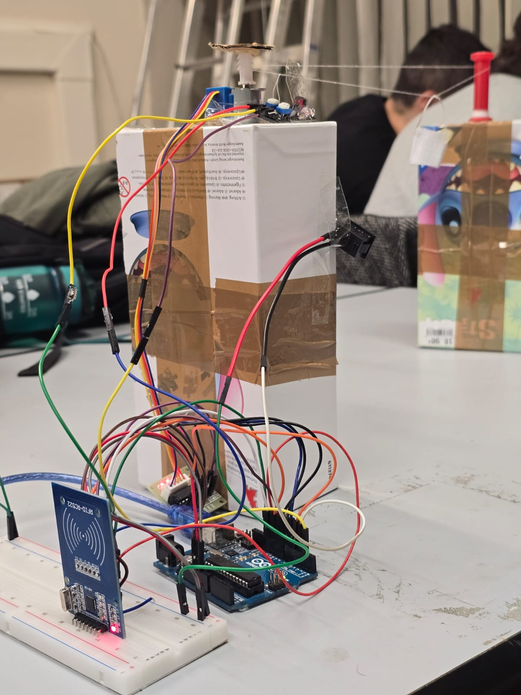

# Control Systems Project 
The following project concerns a team work for the university subject of Control Systems. 

## Cableway Created thanks to the use of the following components: 
- Arduino UNO
- RFID (RC522)
- IR sensor
- ON/OFF button
- Stepper motor 28byj-48

## Role
My role, together with my teammates, was to operate both on the hardware and software side.

